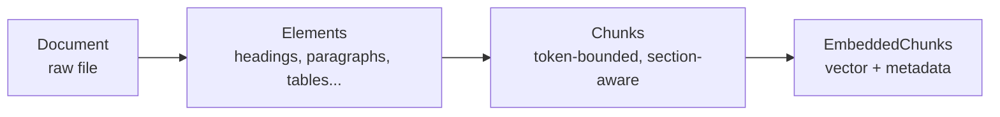
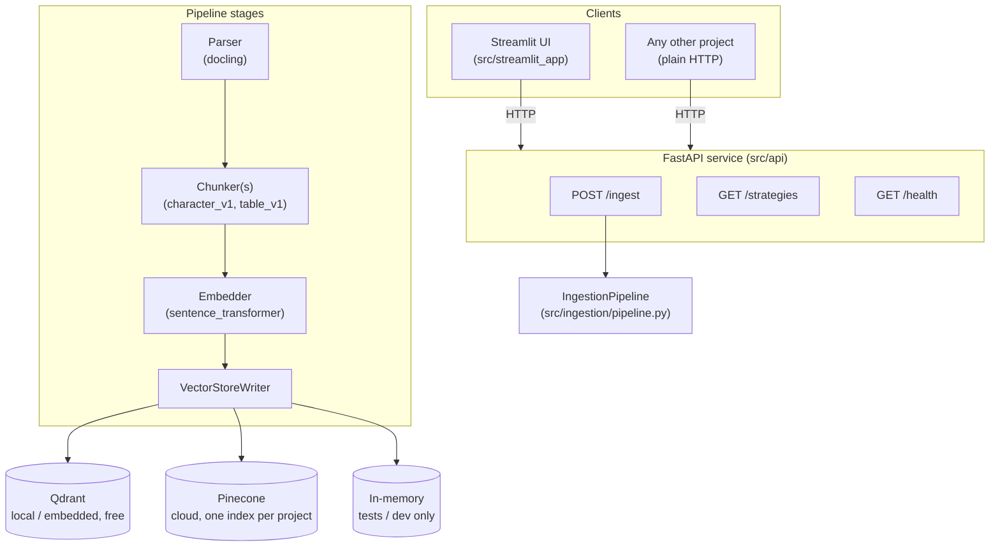

# Agentic RAG

A production-grade, hand-built Retrieval-Augmented Generation (RAG) ingestion system — exposed as a reusable HTTP API with a Streamlit inspector UI, and pluggable across parsing, chunking, embedding, and vector-storage strategies (including a multi-tenant cloud backend on Pinecone).

> **Status:** ingestion (parse → chunk → embed → store), the HTTP API, and the UI are built and tested. Retrieval (hybrid search + reranking) is the next phase — see [Roadmap](#roadmap--project-status).

---

## Table of contents

- [What this project is](#what-this-project-is)
- [Why it's built this way](#why-its-built-this-way)
- [Architecture](#architecture)
- [Tech stack](#tech-stack)
- [Repository layout](#repository-layout)
- [Getting started](#getting-started)
- [Using it](#using-it)
- [Multi-project isolation](#multi-project-isolation)
- [Configuration reference](#configuration-reference)
- [Testing](#testing)
- [Extending the system](#extending-the-system)
- [Roadmap / project status](#roadmap--project-status)

---

## What this project is

Agentic RAG is a from-scratch implementation of a document ingestion pipeline for retrieval-augmented generation: it takes raw documents (Word docs, PDFs, etc. via [Docling](https://github.com/DS4SD/docling)), breaks them into structurally-aware chunks (tables are kept intact, not flattened into text), embeds them, and stores them in a vector database — ready for a future retrieval/agent layer to query.

It's deliberately **not** built on top of LangChain, LlamaIndex, or any other RAG framework. Every stage — parsing, chunking, embedding, storage, idempotency, error handling — is implemented directly, so the underlying concepts are actually understood rather than delegated to a black box. The result is a small, fully-owned codebase that still follows the same architectural discipline you'd expect from a production system.

On top of that core pipeline, this repo now also ships:

- **A FastAPI service** (`src/api/`) that exposes ingestion as a reusable HTTP endpoint — any other project can POST documents to it and get back structured chunks + metadata, without importing this codebase's Python at all.
- **A Streamlit UI** (`src/streamlit_app/`) for uploading documents, choosing a chunking/embedding/storage configuration interactively, and inspecting exactly what chunks and metadata a given configuration produces.
- **Multi-project support**, including a cloud vector store option (Pinecone) so multiple independent projects/tenants can each get their own isolated index, alongside a free local option (Qdrant, embedded mode).

## Why it's built this way

A few engineering decisions in this codebase are worth calling out explicitly, since they're the point of the project as much as the RAG functionality itself:

- **SOLID, not just "it works."** Every pipeline stage (parser, chunker, embedder, vector store) is defined as a `Protocol` interface with a name-keyed registry/factory. The orchestrator depends only on those interfaces, never on a concrete class. Adding a new strategy (a new parser, a new chunking algorithm, a new vector database) means adding a new file and a registration decorator — zero edits to existing code (Open/Closed Principle in practice, not just in theory).
- **Idempotency is a first-class concern.** Re-running ingestion on unchanged content does not re-embed or re-store it — a content-hash index tracks what's already been embedded, keyed by the actual content (not by a document/chunk id that can shift between runs). The backend is pluggable: SQLite by default (one file, zero setup), or MySQL (one shared table, `project_id` in the primary key) when many projects need to share one deployment — see [Multi-project isolation](#multi-project-isolation).
- **Failures don't take down a batch.** A single malformed or unparseable document is dead-lettered (written to `dead_letter/` with the exact stage and traceback) while the rest of the batch keeps processing.
- **Multi-tenancy was treated as a real correctness problem, not an afterthought.** The original single-tenant pipeline's idempotency index was global — two different projects ingesting byte-identical content would have silently starved the second project's storage. This was identified and fixed with per-project isolation (see [Multi-project isolation](#multi-project-isolation)) before the API was built on top of it, and is covered by an explicit regression test.
- **Verified against the real stack, not just mocks.** The pipeline has been run end-to-end — real Docling parsing, a real local embedding model, and both a real embedded Qdrant database and the real FastAPI service — producing the documented, expected output (a table surviving as its own chunk, correct chunk counts, etc.), not just passing unit tests against fakes.

## Architecture

### Data shape

Every document flows through the same fixed shape, regardless of which concrete parser/chunker/embedder/store is plugged in:



- **Element** carries a `type` (heading/paragraph/table/list/code/caption), a `section_path` breadcrumb (its nearest ancestor headings), and — for tables — a structured `TableData` (real header/body rows *and* a markdown rendering), rather than flattened text.
- **Chunk** carries the packed text, a `content_hash` (the idempotency key), and a `ChunkMetadata` block (source, section path, page range, chunk index).
- **EmbeddedChunk** pairs a `Chunk` with its vector, embedding model name, and dimension.

### System overview



Every box in "Pipeline stages" is a `Protocol` + registry (see [Extending the system](#extending-the-system)) — the pipeline itself never imports a concrete implementation by name. The only place allowed to resolve a strategy name into a real class is a **composition root**: `ingestion/cli.py::build_pipeline` for the CLI, `api/dependencies.py::build_pipeline_from_request` for the API.

## Tech stack

| Concern | Choice | Notes |
|---|---|---|
| Language | Python 3.11+ | |
| Document parsing | [Docling](https://github.com/DS4SD/docling) | Handles `.docx`, PDFs, etc.; tables extracted structurally |
| Tokenization | `tiktoken` (`cl100k_base`) | Shared token counter across chunkers |
| Embeddings | `sentence-transformers`, `BAAI/bge-small-en-v1.5` | Local, CPU, no API key required |
| Vector store (local/free) | [Qdrant](https://qdrant.tech/) embedded mode | No server process; persists to a local folder |
| Vector store (cloud/multi-tenant) | [Pinecone](https://www.pinecone.io/) serverless | One index per project |
| Idempotency store (default) | SQLite | One file per project, zero setup |
| Idempotency store (multi-project) | MySQL (`PyMySQL` + `DBUtils` pool) | One shared table, `project_id` in the primary key |
| Config | `pydantic` + `pydantic-settings` | YAML + env var overrides |
| Logging | `structlog` (JSON) | |
| Retry logic | `tenacity` | Wraps the embedding call |
| CLI | `Typer` | |
| API | `FastAPI` + `uvicorn` | |
| UI | `Streamlit` | Talks to the API over plain HTTP, no direct imports |
| Testing | `pytest` | 112 tests as of this writing; see [Testing](#testing) |

## Repository layout

```
src/
  ingestion/            # the core, framework-agnostic pipeline
    models.py             # Document, Element, Chunk, EmbeddedChunk, DocumentResult
    pipeline.py           # IngestionPipeline: parse -> chunk -> dedupe -> embed -> store
    errors.py             # DeadLetterSink / DeadLetterRecord
    observability.py      # structured logging + RunCounters
    config.py             # IngestionSettings (YAML + env)
    cli.py                # composition root for the CLI
    parsers/  chunkers/  embedders/  store/  hashing/
      base.py                 # the Protocol interface for this stage
      factory.py / registry.py  # register_X / get_X / list_registered
      <concrete implementations, one file each>   # hashing/: sqlite_store.py, mysql_store.py

  api/                  # FastAPI service - the reusable HTTP endpoint
    main.py               # app + routers + shutdown lifecycle
    dependencies.py       # composition root for the API (per-request pipeline building, caching)
    schemas.py            # request/response models
    routes/
      ingest.py             # POST /ingest
      meta.py               # GET /strategies, GET /health

  streamlit_app/
    app.py                # upload -> ingest -> inspect chunks/metadata UI

config/ingestion.yaml   # default CLI configuration
tests/                  # pytest suite (ingestion/ and api/)
Docs/                   # deep-dive learning notes (see below)
CLAUDE.md               # full engineering conventions & design log
data/                   # runtime state created by the API (per-project hash db, dead-letter, local Qdrant) - gitignored
```

`CLAUDE.md` and `Docs/` contain a much more detailed, line-by-line account of design decisions and known trade-offs — read those if you want the full engineering story behind any given file.

## Getting started

### Prerequisites

- Python 3.11+
- (Optional) A [Pinecone](https://app.pinecone.io/) account + API key, only if you want to use the cloud vector store instead of the free local Qdrant option.
- (Optional) A reachable MySQL server, only if you want a shared idempotency store across many projects instead of the default per-project SQLite file.

### Install

```bash
python -m venv .venv

# install the core pipeline + dev tools
.venv/Scripts/pip install -e ".[dev]"

# add the API service and/or the Streamlit UI as needed
.venv/Scripts/pip install -e ".[dev,api,ui]"

# add Pinecone support (optional)
.venv/Scripts/pip install -e ".[dev,api,ui,pinecone]"

# add MySQL hash-store support (optional)
.venv/Scripts/pip install -e ".[dev,api,ui,mysql]"
```

*(On macOS/Linux, use `.venv/bin/pip` instead of `.venv/Scripts/pip`.)*

### Configure secrets

```bash
cp .env.example .env
# then fill in PINECONE_API_KEY and/or MYSQL_* if you're using those backends
```

`.env` is loaded automatically (via `python-dotenv`) by the CLI, the API, and the Streamlit app on startup — you don't need to export anything into your shell manually. `.env` is gitignored — never commit real keys. `.env.example` is the tracked template; keep it up to date whenever a new secret is introduced.

## Using it

### 1. CLI (batch ingestion, no server)

```bash
.venv/Scripts/python -m ingestion.cli --input-dir path/to/docs --config config/ingestion.yaml
```

Runs the pipeline once against every file in a directory, using `config/ingestion.yaml` for parser/chunker/embedder/store choice, and prints run counters (`docs_processed`, `chunks_created`, etc.) at the end.

### 2. API service (reusable HTTP endpoint)

```bash
.venv/Scripts/python -m uvicorn api.main:app --reload
```

Then, from any project (Python, curl, another language entirely):

```bash
curl -X POST http://localhost:8000/ingest \
  -F "files=@report.docx" \
  -F 'config={
        "project_id": "my-project",
        "chunking": {"strategy": "character_v1", "chunk_size_tokens": 512, "chunk_overlap_tokens": 50},
        "embedder": {"name": "sentence_transformer"},
        "store": {"name": "qdrant"}
      }'
```

Response shape (trimmed):

```json
{
  "project_id": "my-project",
  "counters": {"docs_processed": 1, "docs_failed": 0, "chunks_created": 3, "chunks_skipped_idempotent": 0},
  "documents": [
    {
      "source_filename": "report.docx",
      "doc_id": "…sha256…",
      "chunks": [
        {"chunk_id": "…", "content_type": "table", "text": "| Quarter | Revenue |...", "metadata": {"section_path": ["Q3 Report", "2 Financials"], "chunk_index": 1, "...": "..."}, "embedding_model": "sentence_transformer", "embedding_dim": 384}
      ],
      "skipped_count": 0,
      "error": null
    }
  ]
}
```

Other endpoints:

- `GET /strategies` — the currently registered parsers/chunkers/embedders/stores, so a client can build its own config UI without hardcoding names.
- `GET /health` — liveness check.

Switch `store.name` to `"pinecone"` (and set `PINECONE_API_KEY`) to write into a cloud, multi-tenant index instead of local Qdrant — see [Multi-project isolation](#multi-project-isolation).

### 3. Streamlit UI (interactive inspection)

With the API running (step 2), in a second terminal:

```bash
.venv/Scripts/python -m streamlit run src/streamlit_app/app.py
```

Open the printed local URL. From there you can:

- Pick a project id, chunking strategy, chunk size/overlap, embedder, and store — all populated live from `GET /strategies`.
- Upload one or more documents and click **Ingest**.
- See run-level metrics, then drill into each document's chunk table; selecting a row shows the full chunk text (tables render as real markdown tables) and its complete metadata.

The UI is a pure HTTP client of the API — it never imports the ingestion package directly, which is the same contract any other consuming project would use.

## Multi-project isolation

Two things need to be kept separate per project/tenant, and both are handled without any changes to the core pipeline's internals:

1. **Idempotency.** Two backends are available, both scoping the content-hash dedupe index per project so two different projects ingesting byte-identical content never collide (without this, the second project's chunks would be silently skipped — the first project's dedupe record would incorrectly say "already embedded"):
   - **SQLite (default):** each project gets its own file (`data/<project_id>/hashes.db`), derived automatically by the API's composition root from `project_id`. Zero setup.
   - **MySQL (opt-in, `AGENTIC_RAG_API_HASH_STORE_NAME=mysql`):** every project shares **one table**, with `project_id` as part of the primary key alongside `content_hash` — the row-level equivalent of "give each project its own file," except centrally queryable and usable from more than one API process/container:
     ```sql
     CREATE TABLE IF NOT EXISTS chunk_hashes (
         project_id   VARCHAR(128) NOT NULL,
         content_hash CHAR(64)     NOT NULL,
         doc_id       VARCHAR(128) NOT NULL,
         chunk_id     VARCHAR(255) NOT NULL,
         embedded_at  DATETIME(6)  NOT NULL,
         PRIMARY KEY (project_id, content_hash),
         KEY idx_chunk_hashes_project_doc (project_id, doc_id)
     ) ENGINE=InnoDB DEFAULT CHARSET=utf8mb4;
     ```
     Created automatically on first use (same as SQLite). Connection details come from `MYSQL_HOST` / `MYSQL_PORT` / `MYSQL_USER` / `MYSQL_PASSWORD` / `MYSQL_DATABASE` in `.env` — one connection pool is shared across every project in the process, not one connection per request.

   Either way, this is covered by a regression test that ingests the same document under two project ids and asserts both actually get stored.
2. **Vector storage.**
   - **Qdrant** (local/free): each project gets its own storage path under `data/<project_id>/qdrant_storage/` by default.
   - **Pinecone** (cloud): each project gets its **own Pinecone index**, named after the project id by default (index dimension/metric are derived automatically from the embedder in use). This is why Pinecone is offered as an option — it has no local file-lock contention, unlike opening multiple embedded-Qdrant clients against the same path, so many projects/tenants can be served concurrently by one running API process.

Pinecone's free tier caps a project at 5 indexes; if you outgrow that, the natural next step (not yet built) is one index per distinct embedder dimension with a Pinecone *namespace* per project inside it.

## Configuration reference

Every field below can be set via `config/ingestion.yaml` (CLI) or per-request JSON (API `config` field); the API's schema (`src/api/schemas.py`) mirrors the CLI's settings (`src/ingestion/config.py`) field-for-field, so defaults behave identically either way.

| Field | Default | Notes |
|---|---|---|
| `parser_name` | `docling` | Only parser implemented so far |
| `chunking.strategy` | `character_v1` | `table_v1` is auto-selected for table elements regardless of this setting |
| `chunking.chunk_size_tokens` | `512` | |
| `chunking.chunk_overlap_tokens` | `50` | |
| `embedder.name` | `sentence_transformer` | |
| `embedder.model_name` | `BAAI/bge-small-en-v1.5` | |
| `embedder.batch_size` | `32` | |
| `store.name` | `qdrant` | `qdrant` \| `pinecone` \| `in_memory` |
| `store.collection_name` / `path` / `url` | — | Qdrant-specific |
| `store.pinecone_index_name` / `pinecone_cloud` / `pinecone_region` / `pinecone_metric` | — | Pinecone-specific; index name defaults to the project id |

The hash store is a **deployment-level** setting, not a per-request one (unlike everything above, it isn't part of the API's `config` field) — set via env var, since which projects share a database is an infrastructure decision, not something an individual upload should choose:

| Setting | Where | Default | Notes |
|---|---|---|---|
| Hash store backend | `AGENTIC_RAG_API_HASH_STORE_NAME` (API) / `hash_store_name` in YAML (CLI) | `sqlite` | `sqlite` \| `mysql` |
| CLI-only project id | `hash_store_project_id` in YAML | `default` | The CLI has no per-request project concept, so a fixed id scopes its MySQL rows when `mysql` is selected |
| MySQL connection | `MYSQL_HOST` / `MYSQL_PORT` / `MYSQL_USER` / `MYSQL_PASSWORD` / `MYSQL_DATABASE` (env only) | — | Never read from a YAML/config file, same as `PINECONE_API_KEY` |

Full field-by-field rationale (why a given default was chosen, known soft limits, etc.) lives in `CLAUDE.md`.

## Testing

```bash
.venv/Scripts/python -m pytest tests/ -v          # everything
.venv/Scripts/python -m pytest tests/ingestion/ -v  # core pipeline only
.venv/Scripts/python -m pytest tests/api/ -v          # HTTP layer only
```

Notes:

- The Pinecone store and the MySQL hash store are both unit-tested against a mocked/fake client by default — neither has a local/embedded test mode, and Pinecone is a paid remote service. Separate, explicitly-opt-in integration tests (`test_real_pinecone_round_trip`, `test_real_mysql_round_trip`) only run when `PINECONE_API_KEY` / `MYSQL_HOST` are set in the environment (loaded from `.env` via a `tests/conftest.py`), and each tears down what it created afterward.
- API endpoint tests use FastAPI's `TestClient` with the real pipeline composition swapped for a fast, deterministic fake embedder + in-memory store via `app.dependency_overrides` — no real model load or network call happens in the default test run.
- Parser/chunker/embedder/store tests build fixture documents on the fly (`python-docx`) rather than committing binary fixtures.

## Extending the system

Every stage is a `Protocol` + a name-keyed registry. To add a new one (say, a new chunking strategy):

1. Create `src/ingestion/chunkers/my_chunker.py` implementing the `Chunker` protocol (`name: str`, `chunk(document, elements, config) -> list[Chunk]`).
2. Decorate the class with `@register_chunker("my_strategy")`.
3. Add the import to `src/ingestion/chunkers/__init__.py` (registration only happens when the module is actually imported — see the gotcha documented in `CLAUDE.md`).

That's it — no existing file changes. The CLI, the API's `/strategies` endpoint, and the Streamlit dropdown all pick it up automatically because they all go through `list_registered()`/`get_*()` rather than hardcoding names. The same three-step pattern applies to parsers, embedders, and vector stores.

## Roadmap / project status

*(This section is the intended place to update as the project evolves — keep it current rather than letting it drift.)*

**Done:**
- [x] Structural parsing (Docling) with table-aware extraction and section-path breadcrumbs
- [x] Token-bounded chunking with overlap, plus a dedicated table-aware chunker
- [x] Local embedding (`sentence-transformers`) with retry logic
- [x] Idempotent storage with dead-lettering for bad documents
- [x] Vector stores: in-memory (dev/test), Qdrant (local/free), Pinecone (cloud, multi-tenant)
- [x] Reusable FastAPI ingestion service with per-request strategy control
- [x] Streamlit UI for interactive ingestion + chunk/metadata inspection
- [x] Multi-project isolation (idempotency index + vector storage both scoped per project)
- [x] Pluggable idempotency backend: SQLite (default, per-project file) or MySQL (opt-in, one shared table across projects)

**Not yet built:**
- [ ] Retrieval layer (`src/retrieval/`): hybrid BM25 + dense search, reranking
- [ ] A second embedder implementation (e.g. an OpenAI-backed one) to prove out the plug-in architecture with a real second example
- [ ] A second chunking strategy beyond `character_v1`/`table_v1` (e.g. semantic/recursive chunking)
- [ ] Async/job-queue ingestion mode for very large batches (current `/ingest` is synchronous by design, which is simpler and sufficient for interactive use)
- [ ] "Browse previously-ingested data" view in the UI (currently shows only the just-triggered run's results)
- [ ] A permanent ADR-style architecture write-up in `Docs/architecture.md`
