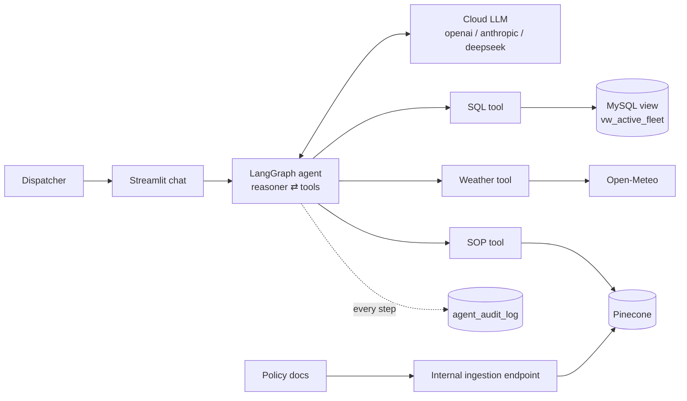

# Cold-Chain Logistics AI-Assistant

A conversational compliance copilot for cold-chain dispatchers. It combines fleet telemetry, live weather and company SOPs to answer "is this shipment in breach, and what do I do?" in seconds.

## Business problem

Cold-chain failures spoil perishable cargo, and every minute of delay costs money. Today a dispatcher who sees a temperature drift must:

1. Query databases and dashboards by hand
2. Search SOPs that change often
3. Work out the right escalation
4. Execute it

The process is slow and error-prone, and it depends on people knowing the latest SOP.

## Solution

A LangGraph agent that reasons across three tools and replies with a cited, action-oriented answer:

| Tool | Source | Answers |
| :--- | :--- | :--- |
| `query_telemetry_db` | MySQL read-only view | Where are shipments, what are temperature, risk and delay? |
| `fetch_corridor_conditions` | Open-Meteo live API | What is the weather at that location? |
| `search_compliance_sop` | Pinecone (RAG) | What do the SOPs say about thresholds, rerouting and escalation? |

Answers follow a fixed format: Executive Summary, Telemetry table, Action Plan, SOP citation. General questions ("Tier 1 vs Tier 2?") skip the telemetry tools.

## Design



- **Presentation:** stateless Streamlit app (`src/ui.py`).
- **Orchestration:** LangGraph ReAct loop with conversation memory (`src/orchestrator.py`).
- **Data:** the agent never sees the raw table, only a clean view.
- **Resilience:** if a tool fails, the agent reports the data as missing instead of guessing. A failed SQL query gets one simplified retry.

## Governance & security

- **Least privilege:** the agent's MySQL user (`usr_fde_ro`) can `SELECT` the view and `INSERT` into the audit log, nothing else.
- **Legacy schema hidden:** the view renames `TS_UTC`, `V_LAT`, `IOT_TEMP_VAL_C`, ... to clean names.
- **Audit trail:** every reasoning step and tool call is written to `agent_audit_log`.
- **Admin-only ingestion:** `src/ingest_sql.py` refuses to run unless the MySQL user is an admin.

## What differs from the original reference project

1. **Policy ingestion goes through our internal ingestion endpoint** (`scripts/ingest_policy_client.py`), which indexes into Pinecone. There is no local SOP ingestion script.
2. **No local LLM.** The reasoning model is a cloud model chosen with `LLM_PROVIDER`. The only local model is the embedding model `BAAI/bge-small-en-v1.5` (384 dimensions). The ingestion endpoint and the agent must use the same one.
3. **Database is MySQL** instead of SQL Server.

## Project layout

```
src/ingest_sql.py                    admin-only CSV -> MySQL loader
src/agent_tools.py                   the 3 tools
src/orchestrator.py                  LangGraph agent, LLM factory, audit logging
src/prompts/system_prompt.txt        agent behavior + answer format
src/ui.py                            Streamlit chat
scripts/setup_security_and_view.sql  view, read-only user, audit table
scripts/ingest_policy_client.py      client for the ingestion endpoint (placeholder)
data/policy/                         SOP documents
```

## Setup

```bash
pip install -r requirements.txt
cp .env.example .env                 # fill in keys

python src/ingest_sql.py             # 1. load telemetry (admin user)
# 2. run scripts/setup_security_and_view.sql in MySQL Workbench (set the agent password first,
#    and put the same one in SQL_AGENT_PASSWORD)
python scripts/ingest_policy_client.py   # 3. index SOPs via the ingestion endpoint

python src/agent_tools.py            # smoke-test the tools
python src/orchestrator.py           # chat in the terminal
streamlit run src/ui.py              # or use the web UI
```

Pinecone index: 384 dimensions, cosine metric, chunk text stored under the `text` metadata key.

## Roadmap

- **Observability:** LangSmith tracing of every graph run (hook marked `TODO(observability)` in the orchestrator)
- **Evaluations:** DeepEval / RAGAS for retrieval quality, tool-choice accuracy and answer faithfulness, run as a CI gate
- **Human-in-the-loop:** approval step before any escalation is executed
