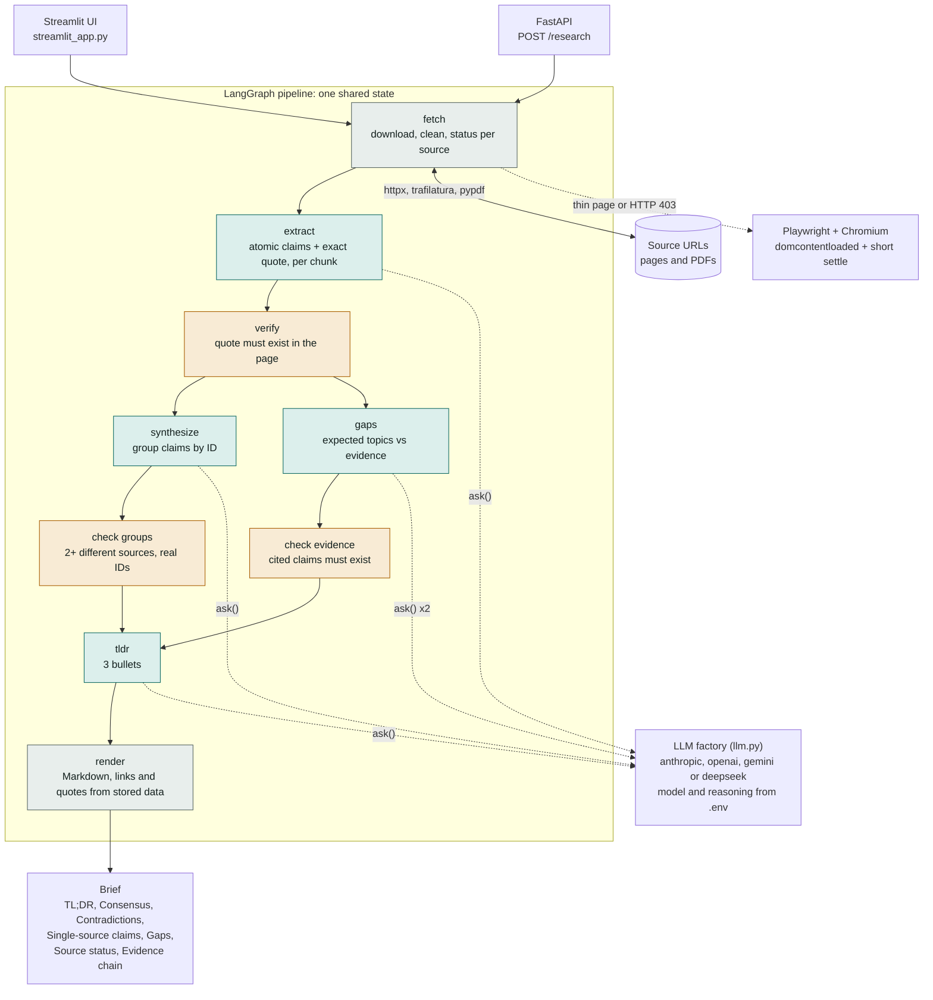

# Multi-Source Research & Synthesis Agent

Give it a **topic and 3–5 URLs** and it returns a research brief you can read in about 2 minutes. Every finding links back to its source with a verified quote.

| Section | Meaning |
|---|---|
| **TL;DR** | Three bullets: strongest agreement, biggest disagreement, biggest gap |
| **Consensus** | 2+ different sources make the same assertion (`Sources: 2 of 5 · Evidence: S1-C02, S5-C01`) |
| **Contradictions** | Position A **vs.** Position B, each with its own stance, sources and claims |
| **Single-source claims** | Verified claims made by only one source and not contested |
| **Gaps** | Topics a decision-maker would expect that no source covers |
| **Source status** | Per source: processed, partial (thin page, paywall text, or extraction gaps), inaccessible (HTTP 403 and similar), timed out, could not be parsed, or failed, plus how it was parsed |
| **Evidence chain** | Finding → claim ID → source → exact quote → URL |

The quote behind every claim is checked against the scraped page before the claim can appear. See [NOTES.md](NOTES.md) for the design and its assumptions.

## Quick start
```bash
uv sync                               # installs everything (app, Streamlit, Playwright, test tools)
uv run playwright install chromium    # one-time browser download (~150 MB) for JavaScript pages
copy .env.example .env                # then set LLM_PROVIDER, LLM_MODEL and the matching API key
uv run streamlit run streamlit_app.py
```
Open http://localhost:8501 and press **Load example**. macOS/Linux: use `cp` instead of `copy`.

## Architecture

**Green** steps call the LLM. **Orange** steps are code that checks the LLM's work before anything moves on. **Grey** steps are plain code. The LLM never sees or writes a URL: links and source names come from stored data, and in the grouping, gaps and TL;DR steps it refers to claims by ID (such as `S2-C07`), which code checks. Each quote is copied by the LLM but must be found in the page text, so an invented URL or quote cannot reach the brief. The claim wording, group summaries and TL;DR are still LLM-written and are not verified against the page.

| Step | Does | Checked by |
|---|---|---|
| fetch | Downloads each URL, extracts the text, and marks it processed, partial, inaccessible, timed out or failed. Re-opens thin or refused pages in a browser. | Status rules in `fetch/` |
| extract | Cuts each source into chunks and asks the LLM for claims with an exact supporting quote. A long chunk that returns nothing is retried once and flagged if still empty. | `verify` |
| verify | Drops any claim whose quote is not found in the page text. | Exact and fuzzy text match |
| synthesize | The LLM proposes consensus and contradiction groups from claim IDs. | `check groups`: 2+ different sources, no invented IDs |
| gaps | The LLM lists the topics a decision-maker would expect, then says which claims cover them. | `check evidence`: a topic counts as covered only if it cites a real claim |
| tldr, render | Writes three bullets, then builds the brief with source links, indicators and the evidence chain. | Links and quotes come from stored data |

## Settings (`.env`)
**Model.** `LLM_PROVIDER` (`anthropic`, `openai`, `gemini` or `deepseek`) and `LLM_MODEL` (the exact model id) are required and come only from `.env`. No model name is built into the code. A missing one stops the run with a message naming the variable.

**Reasoning.** `LLM_REASONING` is optional. Blank uses the model's own default. Otherwise use `off`, `low`, `medium`, `high`, `xhigh` or `max` (each provider accepts a subset, and the app says which). Reasoning is slower: with DeepSeek on 5 sources, `off` took about 20 seconds, `low` about 2 minutes and `high` about 3. Reasoning tokens count toward `LLM_MAX_TOKENS`. `LLM_TEMPERATURE` is a number or `none`, and `LLM_EXTRA_PARAMS` takes a JSON object for anything else, such as `{"thinking_budget": 1024}` for Gemini 2.5.

**Browser rendering (`USE_PLAYWRIGHT`, on by default).** If a plain download returns too little text (under 500 characters) or the site refuses it (HTTP 401/402/403/451), the page is opened in headless Chromium and read again. PDFs and pages that already have enough text never start a browser. The browser waits for the page's DOM (`BROWSER_TIMEOUT`, default 10 seconds) plus a short settle (`BROWSER_SETTLE`, default 1.5 seconds), not for the network to go quiet, which many sites never do. You can see what happened in three places:
- **Source status** says `processed (browser-rendered)` for the sources that needed it.
- The Streamlit sidebar says `Chromium ready`, or warns that it is missing and how to install it.
- `GET /health` returns `js_rendering: ready | browser missing | off`.

If Chromium is not installed, nothing breaks: the page keeps whatever static text it had, is marked `partial`, and the note says `run: uv run playwright install chromium`. A refused page (HTTP 403 and similar) is shown as **inaccessible**, not as a paywall, since a refusal only proves our fetcher was denied. "Paywall" appears only when the page text itself says so. Nothing is bypassed.

**Extraction gaps.** If a long chunk of a source returns no claims, it is retried once. If it is still empty, the source is marked `partial` with `N/M extraction chunks returned no claims; coverage may be incomplete`, so a thin result is never presented as complete.

## Run
```bash
uv run streamlit run streamlit_app.py                    # UI at http://localhost:8501
uv run uvicorn research_agent.api:app --reload           # API at http://localhost:8000/docs
```

```bash
curl -X POST http://localhost:8000/research \
  -H "Content-Type: application/json" \
  -d '{"topic": "Effectiveness of arbitration vs litigation in consumer disputes in India",
       "urls": ["https://example.com/a", "https://example.com/b", "https://example.com/c"]}'
```
The response is `text/markdown`. Each brief is also saved to `outputs/<topic-slug>-<timestamp>.md` (path in the `X-Brief-Path` header).

| Endpoint | |
|---|---|
| `POST /research` | `{topic, urls[3..5]}` → Markdown brief. 422 for invalid input, 502 if fewer than 2 sources were readable, 503 if the LLM settings are missing. |
| `GET /health` | Active provider, model, reasoning level and browser-rendering status. |

## Logging
One line per node and per LLM call, tagged with a short run id (`[f06673]`) so concurrent requests can be told apart. `LOG_LEVEL=INFO` (default) shows sizes, timings, counts and why groups were rejected. `LOG_LEVEL=DEBUG` also shows each full prompt and answer (clipped to `LOG_CLIP_CHARS`). Every LLM call goes through `ask()` in [pipeline/trace.py](src/research_agent/pipeline/trace.py).

## Tests
```bash
uv run pytest
```
They use mocked HTTP and a fake LLM, so no API key, network or Chromium is needed. They cover HTML/PDF parsing, paywalls and the browser fallback, quote grounding, group validation, the evidence output, API validation, settings, and the Streamlit app.

## Layout
```
streamlit_app.py       Streamlit UI
src/research_agent/
  api.py               FastAPI app
  config.py, llm.py    settings + provider factory
  models.py            Pydantic schemas (domain + LLM structured output)
  fetch/               httpx fetcher, HTML/PDF/browser extraction, paywall detection
  pipeline/            extract, verify, synthesize, gaps, LangGraph wiring, tracing
  render/              Markdown template + shared view helpers
tests/
```
